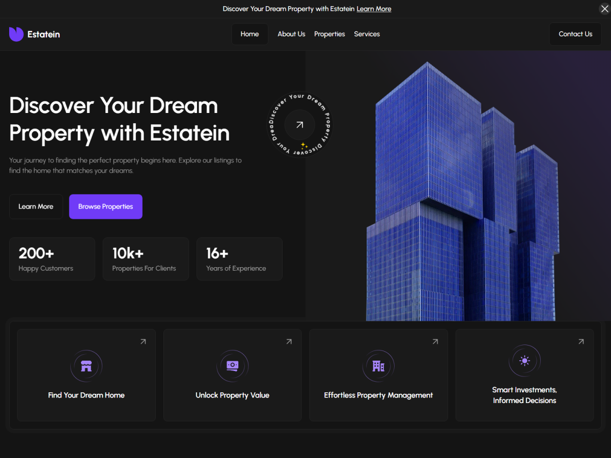

# Estatein — Real Estate WordPress Theme

A pixel-perfect, dark-mode real estate theme for WordPress, converted from a Figma design. It's a **classic PHP theme** with a modern front-end build (**Vite + Dart Sass**), an **ACF-driven content model**, custom post types for listings/agents/testimonials/FAQs, and **built-in SEO** (structured data, meta/Open Graph, XML sitemap, `llms.txt`).



---

## Features

- **Pixel-perfect, responsive home page** (mobile-first) with six sections: header, hero (headline + stats + value-props), featured properties, testimonials, FAQ, and CTA + footer.
- **Design system** — CSS custom-property tokens (purple `#703BF7` + grey ramp), self-hosted **Urbanist** (subset `woff2`, preloaded), consistent buttons/cards/spacing.
- **Custom post types** — `property`, `agent`, `testimonial`, `faq` (+ taxonomies `property_type`, `property_location`, `property_status`). Repeatable content lives in CPTs because the theme targets **free ACF** (no Repeater/Options page).
- **ACF Local JSON content model** — every section maps to a field group synced in `acf-json/`. Global settings use a dedicated "Site Settings" page (free-ACF pattern).
- **Card carousels** with a live "NN of NN" pager that reflects the real item count.
- **Full-screen mobile menu** with an accessible close button (× / Esc / tap-to-close).
- **SEO built in** (`inc/seo.php`): meta description + Open Graph + Twitter cards, single canonical, and a JSON-LD `@graph` — `Organization`, `WebSite` + `SearchAction`, `FAQPage`, `Product`+`Offer` (property listings), `BreadcrumbList`. Plus `llms.txt` and WP Site Icon.
- **Performance-first** — WebP imagery with explicit dimensions (near-zero CLS), lazy-loading below the fold, hashed/cached Vite bundle, no render-blocking third-party JS.
- **Accessibility** — semantic landmarks, single H1 + heading hierarchy, 100% image alt coverage, focus-visible styles, reduced-motion support.

## Tech stack

| Layer | Tool |
|---|---|
| Templating | Classic WordPress PHP theme |
| Styling | Dart Sass (`src/scss`) → compiled by Vite → `dist/` |
| Scripts | ES modules (`src/js`) bundled by Vite |
| Content | Advanced Custom Fields (free) + Local JSON |
| Build | Vite 5 (hashed output + manifest) |

## Requirements

- WordPress **6.4+**
- PHP **8.1+**
- **Advanced Custom Fields** (free) 6.2+
- Node **18+** — only needed to rebuild assets (the compiled `dist/` is committed)

## Installation

1. Copy/clone this repo into `wp-content/themes/` (folder name `realestate`):
   ```bash
   git clone https://github.com/amr99osama/growmodo-theme-dev.git wp-content/themes/realestate
   ```
2. Install & activate **Advanced Custom Fields** (free).
3. **Appearance → Themes → Activate** "Estatein". Field groups load automatically from `acf-json/`, and CPTs/rewrite rules self-register.
4. *(Optional)* Load demo content — see **Demo content** below.

The theme renders immediately on activation because `dist/` (built CSS/JS) is committed. Only run the build (below) if you change `src/`.

## Development

```bash
npm install
npm run build      # production build → dist/ (+ manifest)
npm run dev        # Vite dev server with HMR
```

For HMR, set the dev-server flag in `wp-config.php` while `npm run dev` is running:

```php
define( 'RE_VITE_DEV', true );
```

`inc/enqueue.php` reads `dist/.vite/manifest.json` and enqueues the hashed CSS/JS (or loads from the Vite dev server when `RE_VITE_DEV` is on).

## Project structure

```
realestate/
├── style.css                # Theme header (metadata only)
├── functions.php            # Bootstraps inc/ modules
├── front-page.php           # Home: hero → featured → testimonials → faq → cta
├── header.php  footer.php   # Global document shell
├── single-*.php archive-*.php page-*.php   # Templates
├── inc/                     # setup, enqueue, acf, cpt, taxonomy, helpers, icons, seo, seed …
├── template-parts/
│   ├── global/              # site-header, mobile-menu, site-footer …
│   ├── sections/            # hero, featured-properties, testimonials, faq, cta …
│   ├── cards/               # property, testimonial, agent, post
│   └── components/          # section-heading, pagination, breadcrumbs
├── acf-json/                # ACF Local JSON field groups
├── src/scss/                # Design tokens + component/section styles
├── src/js/                  # nav, carousel, gallery, filters, reveal
├── dist/                    # Built assets (committed)
├── assets/                  # fonts (Urbanist woff2) + images (logo, hero, demo)
└── tests/                   # Node smoke/lint/SEO checks
```

## Content model

- **CPTs:** `property`, `agent`, `testimonial`, `faq`.
- **Taxonomies:** `property_type`, `property_location`, `property_status`.
- **ACF groups (`acf-json/`):** `group_re_home` (home sections), `group_re_property`, `group_re_agent`, `group_re_testimonial`, `group_re_faq`, `group_re_site_settings`.
- **Site Settings:** free ACF has no Options Page, so global settings (header CTA, contact, footer, socials) live on an auto-created "Site Settings" page; `re_option( $name )` reads from it.

## Demo content

Populates properties, agents, testimonials, FAQs, home sections, and site settings (idempotent — re-running clears prior demo content first):

```bash
# WP-CLI
wp re seed --force
```

Or in the admin: **Tools → RE Seed Demo** (requires `WP_DEBUG`).

## Customization

- **Colors / spacing / radii:** `src/scss/_tokens.scss` (`:root` custom properties).
- **Fonts:** `src/scss/_fonts.scss` + `assets/fonts/` (self-hosted Urbanist).
- **Sections:** edit the matching part in `template-parts/sections/` and its `src/scss/sections/_*.scss`.
- **Icons:** inline SVGs in `inc/icons.php` (`re_icon()`, `re_fill_icon()`, `re_logo_mark()`).
- Rebuild with `npm run build` after any `src/` change.

## SEO

Handled entirely in the theme (`inc/seo.php`) — no plugin required:

- Context-aware `<title>`, meta description, Open Graph & Twitter cards, single canonical.
- JSON-LD `@graph`: `Organization` (+ logo), `WebSite` (+ `SearchAction`), `FAQPage`, `Product`/`Offer` on property pages (price, beds/baths/area/location), `BreadcrumbList`.
- WordPress core **XML sitemap** (`/wp-sitemap.xml`), **`llms.txt`** for AI answer engines, and a **Site Icon**.

## Author

**amr99osama** — https://github.com/amr99osama
